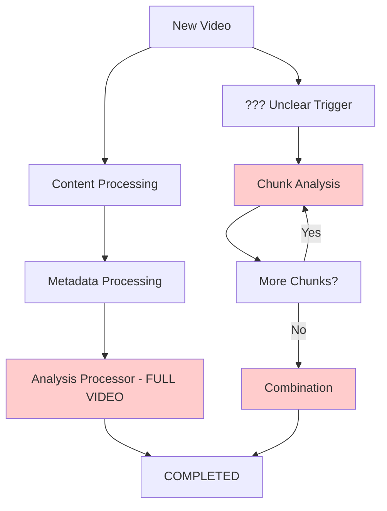

# Video Insight System - Processor Documentation

## Overview

This document provides comprehensive documentation for all processors in the video insight gathering system. The system uses BullMQ job queues to handle asynchronous video processing, insight extraction, and research question answering with proper rate limiting and quota management.

## Business Context

The system is designed to:
1. **Monitor channels** for new video content
2. **Gather metadata** about discovered videos 
3. **Extract insights** from video content in manageable chunks
4. **Answer research questions** by synthesizing gathered insights
5. **Track performance** through periodic statistics updates

This is not just technical "analysis" but a business intelligence system for extracting actionable insights from video content.

## Current Workflow Issues

⚠️ **IMPORTANT**: The current system has multiple problems:

1. **Redundant Processing**: Two different paths for the same work
2. **Poor Naming**: Technical terms like "analysis" and "combination" don't reflect business purpose
3. **Tight Coupling**: Metadata processing immediately triggers chunk jobs
4. **Unclear Separation**: Processors mix concerns and responsibilities

## Intended Workflow (Updated Requirements)

Based on your requirements, the system should follow this clear flow:

```
1. Channel Added → Schedule periodic polling + statistics updates
2. New Video Detected → Save to DB + Gather metadata
3. Periodic Readiness Check → Find videos ready for insight gathering  
4. Extract Insights → Process video chunks to gather useful insights
5. Answer Research Questions → Synthesize insights based on research prompts
6. Track Performance → Schedule periodic statistics updates
```

This separates concerns and uses business-focused naming that reflects the actual purpose of each step.

## Proposed Processor Architecture (Improved Naming & Separation)

### 1. Channel Monitoring Processor (`channel-monitoring.processor.ts`)
*Previously: `channel-poll.processor.ts`*

**Business Purpose**: Continuously monitor YouTube channels for new video content

**Queue**: `channel-monitoring`
**Trigger**: Scheduled periodically when channel is added
**Input**: `{ channelId: string }`

**Workflow**:
1. Fetches channel from database
2. Calls YouTube API to get latest videos (up to `fetchLastN`)
3. For each new video found:
   - Creates new `Content` document with status `DISCOVERED`
   - Queues `video-discovery` job

**Rate Limits**: Standard (50 req/min) - YouTube API calls only
**Dependencies**: YouTube API, Channel model, Content model

**Key Features**:
- Skips existing videos (prevents duplicates)
- Detailed logging of API responses
- Handles YouTube API errors gracefully

---

### 2. Video Discovery Processor (`video-discovery.processor.ts`)
*Previously: `content-processing.processor.ts`*

**Business Purpose**: Initialize newly discovered videos for the insight gathering pipeline

**Queue**: `video-discovery`
**Trigger**: When new video is discovered by Channel Monitoring
**Input**: `{ contentId: string }`

**Workflow**:
1. Updates content status to `INITIALIZING`
2. Queues `video-metadata` job
3. Sets `discoveredAt` timestamp

**Rate Limits**: Standard (not AI processing)
**Dependencies**: Content model

**Error Handling**:
- Distinguishes validation vs. retryable errors
- Updates content status appropriately (`FAILED` vs `RETRY_PENDING`)

---

### 3. Video Metadata Gathering Processor (`video-metadata.processor.ts`)
*Previously: `metadata-processing.processor.ts`*

**Business Purpose**: Gather essential video metadata needed for insight extraction

**Queue**: `video-metadata`  
**Trigger**: After video discovery
**Input**: `{ contentId: string }`

**Workflow**:
1. Fetches video metadata using `VideoAnalysisService.fetchVideoMetadata()`
2. Saves metadata to content document
3. Updates status to `METADATA_READY`
4. **Does NOT queue insight jobs** (decoupling improvement)

**Rate Limits**: Standard (YouTube API calls only)
**Dependencies**: VideoAnalysisService, Content model

**Metadata Includes**:
- Video duration, view count, channel info
- Used for insight gathering token estimation

---

### 4. Video Readiness Processor (`video-readiness.processor.ts`) 🆕
*New processor for better separation of concerns*

**Business Purpose**: Periodically check for videos ready for insight gathering and queue appropriate jobs

**Queue**: `video-readiness`
**Trigger**: Scheduled every 5 minutes
**Input**: `{ batchSize?: number }`

**Workflow**:
1. Finds videos with status `METADATA_READY`
2. For each ready video:
   - Calculates optimal chunk configuration based on metadata
   - Queues multiple `insight-gathering` jobs (one per chunk)
   - Updates status to `INSIGHTS_QUEUED`

**Rate Limits**: Standard (database operations only)
**Dependencies**: Content model, VideoChunk model

**Benefits**:
- ✅ Decouples metadata gathering from insight processing
- ✅ Allows batch processing of ready videos
- ✅ Better control over insight gathering queue load
- ✅ Can implement intelligent scheduling (priority, resource availability)

---

### 5. Video Insight Gathering Processor (`video-insight-gathering.processor.ts`)
*Previously: `chunk-analysis.processor.ts`*

**Business Purpose**: Extract useful insights from individual video segments for later research question answering

**Queue**: `insight-gathering`
**Trigger**: When video is ready (via Video Readiness Processor)
**Input**: `{ contentId, chunkIndex, startTime, endTime, totalChunks, videoInfo }`

**Workflow**:
1. Pre-checks quota and applies rate limiting
2. Extracts insights from video chunk using `VideoInsightService.gatherChunkInsights()`
3. Saves insights to `VideoInsight` collection (better than "VideoChunk")
4. Checks if all insights gathered for video
5. If complete, updates video status to `INSIGHTS_GATHERED`
6. **Does NOT queue research jobs** (decoupling improvement)

**Rate Limits**: Conservative (10 req/min) - AI processing
**Dependencies**: VideoInsightService, VideoInsight model, quota management

**Key Improvements**:
- Business-focused naming (insights vs. analysis)
- Clear purpose (gathering insights for research)
- Better error handling with insight-level retries
- Decoupled from research processing (Research Scheduler handles research jobs)

---

### 6. Research Scheduler Processor (`research-scheduler.processor.ts`) 🆕
*New processor for decoupled research prompt scheduling*

**Business Purpose**: Periodically find videos with gathered insights and schedule research prompt processing

**Queue**: `research-scheduling`
**Trigger**: Scheduled every 5-10 minutes
**Input**: `{ batchSize?: number, promptId?: string }`

**Workflow**:
1. Finds videos with status `INSIGHTS_GATHERED`
2. Retrieves available research prompts from database
3. For each video-prompt combination not yet processed:
   - Queues `research-processing` job
   - Records scheduling in research tracking

**Rate Limits**: Standard (database operations only)
**Dependencies**: Content model, Prompt model, research tracking

**Benefits**:
- ✅ Supports multiple research prompts per video
- ✅ Decouples insight gathering from research processing
- ✅ Enables adding new prompts to existing videos
- ✅ Flexible research workflow management

---

### 7. Research Prompt Processing Processor (`research-prompt-processing.processor.ts`)
*Previously: `combination.processor.ts`*

**Business Purpose**: Process specific research prompts against video insights

**Queue**: `research-processing`
**Trigger**: When scheduled by Research Scheduler
**Input**: `{ contentId: string, promptId: string, forceModel?: string }`

**Workflow**:
1. Pre-checks quota and applies rate limiting
2. Retrieves all gathered insights for the video
3. Retrieves specific research prompt
4. Uses `ResearchService.processPrompt()` to synthesize insights with the prompt
5. Saves research result to research tracking collection
6. Does NOT change video status (stays `INSIGHTS_GATHERED`)

**Rate Limits**: Moderate (8 req/min) - AI processing
**Dependencies**: ResearchService, quota management, research tracking

**Key Improvements**:
- Processes one prompt at a time (better granularity)
- No video status changes (videos stay available for more research)
- Research results tracked separately per prompt

---

### 7. Performance Tracking Processor (`performance-tracking.processor.ts`)
*Previously: `stats.processor.ts`*

**Business Purpose**: Track video and channel performance metrics for business intelligence

**Queue**: `performance-tracking`
**Trigger**: After research completion, scheduled periodically
**Input**: `{ contentId?: string, channelId?: string, type: 'video' | 'channel' }`

**Workflow**:
- **Video tracking**: Updates individual video statistics from YouTube API
- **Channel tracking**: Updates aggregated channel performance metrics

**Rate Limits**: Standard (YouTube API calls only)
**Dependencies**: YouTube API, Content model

**Key Improvements**:
- Clear business purpose (performance tracking vs. generic stats)
- Handles both video and channel level metrics
- Better scheduling integration

---

### 8. Quota Cleanup Processor (`quota-cleanup.processor.ts`)
*No changes - name is already clear*

**Business Purpose**: Maintenance processor for quota management system

**Queue**: `quota-cleanup`
**Trigger**: Scheduled periodically
**Input**: `{ type: 'overload' | 'rpd', model?: string }`

**Workflow**: Unchanged - already well-defined

**Dependencies**: QuotaManagerService, QuotaViolation model

## Comprehensive Naming Improvements

### Processor & Queue Renaming

| Current Name | Proposed Name | Business Purpose | Queue Name |
|--------------|---------------|------------------|------------|
| `ChannelPollProcessor` | `ChannelMonitoringProcessor` | Monitor channels for new content | `channel-monitoring` |
| `ContentProcessingProcessor` | `VideoDiscoveryProcessor` | Initialize discovered videos | `video-discovery` |
| `MetadataProcessingProcessor` | `VideoMetadataGatheringProcessor` | Gather video metadata | `video-metadata` |
| **[NEW]** | `VideoReadinessProcessor` | Check videos ready for insights | `video-readiness` |
| `ChunkAnalysisProcessor` | `VideoInsightGatheringProcessor` | Extract insights from video chunks | `insight-gathering` |
| **[NEW]** | `ResearchSchedulerProcessor` | Schedule research prompts for analyzed videos | `research-scheduling` |
| `CombinationProcessor` | `ResearchPromptProcessingProcessor` | Process specific research prompts | `research-processing` |
| `StatsProcessor` | `PerformanceTrackingProcessor` | Track performance metrics | `performance-tracking` |
| `QuotaCleanupProcessor` | *(no change)* | Maintain quota system | `quota-cleanup` |
| **[REMOVE]** | ~~`AnalysisProcessor`~~ | *(redundant)* | ~~`analysis`~~ |

### Service Renaming

| Current Name | Proposed Name | Business Purpose |
|--------------|---------------|------------------|
| `VideoAnalysisService` | `VideoInsightService` | Extract insights from video content |
| `VideoCombinationService` | `ResearchService` | Answer research questions using insights |
| `EnhancedQuotaManagerService` | *(no change)* | Manage API quotas and rate limits |
| `BullMQRateLimitService` | *(no change)* | Handle BullMQ rate limiting |

### Database Collection Renaming

| Current Name | Proposed Name | Business Purpose |
|--------------|---------------|------------------|
| `VideoChunk` | `VideoInsight` | Store extracted insights from video segments |
| `Content` | *(no change)* | Store video metadata and research results |
| `Channel` | *(no change)* | Store channel information |

### Status Flow Improvements

| Current Status | Proposed Status     | Business Meaning                                              |
|----------------|---------------------|---------------------------------------------------------------|
| `PENDING` | `DISCOVERED`        | Video found but not yet initialized                           |
| `PROCESSING` | `INITIALIZING`      | Setting up video for insight gathering                        |
| `METADATA_FETCHED` | `METADATA_READY`    | Ready for insight extraction                                  |
| **[NEW]** | `INSIGHTS_QUEUED`   | Insight gathering jobs scheduled                              |
| `ANALYZED` | `INSIGHTS_GATHERED` | All insights extracted - ready for research prompts         |
| ~~`COMPLETED`~~ | **[REMOVED]**       | *(No single completion status - research is per-prompt)*     |

### Key Benefits of New Naming

1. **Business Clarity**: Names reflect actual business purposes, not technical implementation
2. **Workflow Understanding**: Clear progression from discovery → insights → research answers
3. **Team Communication**: Non-technical stakeholders can understand the process
4. **Maintenance**: Easier to understand what each component does
5. **Extensibility**: Names accommodate future research capabilities

### Service Method Renaming

**VideoInsightService** (previously VideoAnalysisService):
```typescript
// Current methods → Proposed methods
analyzeYouTubeVideo() → gatherVideoInsights()
analyzeVideoChunkDirect() → gatherChunkInsights()
fetchVideoMetadata() → fetchVideoMetadata() // no change
```

**ResearchService** (previously VideoCombinationService):
```typescript
// Current methods → Proposed methods
combineChunkAnalysesUsingAI() → answerResearchQuestions()
getCombinationStatus() → getResearchStatus()
```

This naming scheme transforms the system from a technical "video analysis" pipeline into a clear "video insight and research" business intelligence system.

## Detailed Redundancy Analysis

### AnalysisProcessor vs ChunkAnalysisProcessor + CombinationProcessor

**The Problem**: Two different approaches do the same work

#### AnalysisProcessor (Current Main Path)
```typescript
// Single job does everything:
async analyzeYouTubeVideo(url, contentId, metadata) {
  // 1. Download video
  // 2. Split into chunks internally  
  // 3. Analyze each chunk with AI
  // 4. Combine all chunks
  // 5. Return final result
}
```

**Issues**:
- ❌ No visibility into chunk progress
- ❌ If one chunk fails, entire video fails
- ❌ Cannot retry individual chunks
- ❌ Cannot parallelize chunk processing
- ❌ Large memory usage (holds entire video)

#### ChunkAnalysisProcessor + CombinationProcessor (Better Approach)
```typescript
// Multiple small jobs:
// Job 1-N: Analyze individual chunks
async analyzeVideoChunkDirect(url, videoInfo, chunkData, prompt) {
  // Analyze just this one chunk
}

// Final job: Combine results  
async combineChunkAnalysesUsingAI(contentId, videoInfo) {
  // Combine all stored chunk results
}
```

**Benefits**:
- ✅ Progress visibility (can see which chunks are done)
- ✅ Granular retries (only failed chunks retry)
- ✅ Potential for parallel processing
- ✅ Lower memory usage per job
- ✅ Better error handling

### Code Overlap Analysis

Both approaches use the same underlying services but differently:

#### VideoAnalysisService Methods Used

**AnalysisProcessor** uses:
- `analyzeYouTubeVideo()` - Does everything internally

**ChunkAnalysisProcessor** uses:
- `analyzeVideoChunkDirect()` - Analyzes single chunk
- `combineChunkAnalysesUsingAI()` - Combines chunks

#### The Core Issue

Looking at the VideoAnalysisService, `analyzeYouTubeVideo()` internally:
1. Downloads video
2. Splits into chunks  
3. Calls `analyzeVideoChunkDirect()` for each chunk
4. Calls `combineChunkAnalysesUsingAI()` to combine

**This means**:
- AnalysisProcessor is just a wrapper around the chunk-based approach
- But it does it all in one job instead of separate jobs
- The chunk-based processors expose the same functionality with better job granularity

### Problems with Current Architecture

#### 1. Redundant Processing Paths

The current system has TWO different approaches that do the same work:



**Problems**:
- Two paths do identical work differently
- Unclear which path is used when
- No business clarity in naming

#### 2. Poor Business Naming

Current technical names don't reflect business purpose:
- "Analysis" → Should be "Insight Gathering"  
- "Combination" → Should be "Research Question Answering"
- "Content Processing" → Should be "Video Discovery"

#### 3. Tight Coupling Issues

- Metadata processing immediately triggers insight jobs
- No buffer for load management
- Difficult to implement intelligent scheduling

#### 4. Missing Scheduled Tasks

- ❌ Periodic video performance tracking not scheduled
- ❌ Channel-level statistics not automated  
- ❌ No clear scheduling when channels are added

## Recommended Architecture

### Improved Business-Focused Architecture

Here's the recommended architecture with better naming, separation of concerns, and the new Video Readiness Processor:

```mermaid
graph TD
    A[Channel Added] --> B[Schedule Channel Monitoring + Performance Tracking]
    B --> C{Periodic Channel Monitoring}
    C --> D[YouTube API: Get Latest Videos]
    D --> E{New Videos Found?}
    E -->|Yes| F[Create Content Record - Status: DISCOVERED]
    E -->|No| G[End Monitoring Cycle]
    F --> H[Queue: video-discovery]
    
    H --> I[Video Discovery Processor]
    I --> J[Update Status: INITIALIZING]
    J --> K[Queue: video-metadata]
    
    K --> L[Video Metadata Gathering]
    L --> M[Fetch YouTube Metadata]
    M --> N[Save Metadata to Content]
    N --> O[Update Status: METADATA_READY]
    O --> P[Wait for Readiness Check]
    
    P --> Q{Periodic Video Readiness Check}
    Q --> R[Find Videos with METADATA_READY Status]
    R --> S[Calculate Optimal Chunks]
    S --> T[Queue Multiple insight-gathering Jobs]
    T --> U[Update Status: INSIGHTS_QUEUED]
    
    U --> V1[Video Insight Gathering 1]
    U --> V2[Video Insight Gathering 2] 
    U --> V3[Video Insight Gathering N]
    
    V1 --> W1[Extract Insights from Chunk 1]
    V2 --> W2[Extract Insights from Chunk 2]
    V3 --> W3[Extract Insights from Chunk N]
    
    W1 --> X1[Save to VideoInsight Collection]
    W2 --> X2[Save to VideoInsight Collection]
    W3 --> X3[Save to VideoInsight Collection]
    
    X1 --> Y{All Insights Gathered?}
    X2 --> Y
    X3 --> Y
    
    Y -->|No| Z[Wait for Remaining Insights]
    Y -->|Yes| AA[Update Status: INSIGHTS_GATHERED]
    AA --> AB[Video Ready for Research Prompts]
    
    AB --> AC{Periodic Research Scheduler}
    AC --> AD[Find Videos with INSIGHTS_GATHERED Status]
    AD --> AE[Get Available Research Prompts]
    AE --> AF[Check Video-Prompt Combinations Not Yet Processed]
    AF --> AG[Queue Multiple research-processing Jobs]
    
    AG --> AH1[Research Prompt Processing 1]
    AG --> AH2[Research Prompt Processing 2]
    AG --> AH3[Research Prompt Processing N]
    
    AH1 --> AI1[Process Prompt 1 with Video Insights]
    AH2 --> AI2[Process Prompt 2 with Video Insights]
    AH3 --> AI3[Process Prompt N with Video Insights]
    
    AI1 --> AJ1[Save Research Result 1]
    AI2 --> AJ2[Save Research Result 2]
    AI3 --> AJ3[Save Research Result N]
    
    AJ1 --> AK[Research Results Available]
    AJ2 --> AK
    AJ3 --> AK
    
    AA --> AL[Schedule Periodic Video Performance Tracking]
    AL --> AM[Performance Tracking - Video Updates]
    AM --> AN[Update Video Statistics Daily]
    
    %% Channel-level performance tracking
    AO[Channel Performance Schedule] --> AP[Performance Tracking - Channel Updates]
    AP --> AQ[Update Channel Statistics]
    
    %% Maintenance
    AR[Scheduled Daily] --> AS[Quota Cleanup]
    AS --> AT[Clean Old Quota Data]
    
    %% Style the new decoupled architecture
    style Q fill:#ffffcc
    style R fill:#ffffcc
    style S fill:#ffffcc
    style T fill:#ffffcc
    
    %% Style the insight gathering (parallel processing)
    style V1 fill:#ccffcc
    style V2 fill:#ccffcc  
    style V3 fill:#ccffcc
    style W1 fill:#ccffcc
    style W2 fill:#ccffcc
    style W3 fill:#ccffcc
    
    %% Style research scheduling (new decoupled flow)
    style AC fill:#ffccff
    style AD fill:#ffccff
    style AE fill:#ffccff
    style AF fill:#ffccff
    style AG fill:#ffccff
    
    %% Style research processing (parallel per prompt)
    style AH1 fill:#aaffaa
    style AH2 fill:#aaffaa
    style AH3 fill:#aaffaa
    style AI1 fill:#aaffaa
    style AI2 fill:#aaffaa
    style AI3 fill:#aaffaa
    
    %% Style scheduling improvements
    style B fill:#ffeecc
    style AL fill:#ffeecc
    style AO fill:#ffeecc
```



### Key Improvements

#### 1. Clear Business-Focused Naming
- **Channel Monitoring** (not "polling") - reflects business purpose
- **Insight Gathering** (not "chunk analysis") - clear research focus  
- **Research Question Answering** (not "combination") - specific outcome
- **Performance Tracking** (not generic "stats") - business intelligence focus

#### 2. Proper Separation of Concerns

**Video Metadata Gathering** → **Metadata Only**
- Fetches and saves video metadata
- Does NOT queue insight jobs (decoupling improvement)
- Clean single responsibility

**Video Readiness Processor** → **Intelligent Scheduling** 🆕
- Periodic check for videos ready for insight gathering
- Batch processing for efficiency  
- Load management and intelligent scheduling
- Decouples metadata from insight processing

**Video Insight Gathering** → **Individual Insight Extraction**
- Each job extracts insights from one video segment
- Business-focused: gathering insights for research
- Better retry granularity and progress visibility
- Saves to `VideoInsight` collection (not "VideoChunk")

**Research Question Answering** → **Synthesis & Research**
- Synthesizes insights to answer specific research questions
- Clear business outcome focus
- Uses research prompts effectively

#### 3. Proper Scheduling

**When Channel Added**:
```typescript
// Schedule periodic polling
await channelPollQueue.add(
  'poll-channel',
  { channelId },
  { repeat: { cron: '*/30 * * * *' } } // Every 30 minutes
);

// Schedule periodic stats updates for channel
await statsQueue.add(
  'update-channel-stats', 
  { channelId },
  { repeat: { cron: '0 */6 * * *' } } // Every 6 hours
);
```

**When Video Analysis Completes**:
```typescript
// Schedule periodic stats for this specific video
await statsQueue.add(
  'update-video-stats',
  { contentId },
  { repeat: { cron: '0 12 * * *' } } // Daily at noon
);
```

#### 4. Enhanced Metadata Processing

Current metadata processor should be enhanced to:

```typescript
async process(job: Job<{ contentId: string }>): Promise<void> {
  // 1. Fetch metadata
  const { metadata } = await this.videoAnalysisService.fetchVideoMetadata(youtubeUrl);
  
  // 2. Calculate chunks needed
  const chunks = this.calculateVideoChunks(metadata.duration);
  
  // 3. Save metadata
  await this.contentModel.updateOne(
    { _id: contentId },
    { metadata, status: 'METADATA_FETCHED' }
  );
  
  // 4. Queue chunk analysis jobs
  for (const chunk of chunks) {
    await this.chunkAnalysisQueue.add('analyze-chunk', {
      contentId,
      chunkIndex: chunk.index,
      startTime: chunk.startTime,
      endTime: chunk.endTime,
      totalChunks: chunks.length
    });
  }
}
```

### Implementation Steps

1. **Phase 1: Enhance Existing Processors**
   - Update `MetadataProcessingProcessor` to queue chunk jobs
   - Ensure `ChunkAnalysisProcessor` works with new flow
   - Test chunk-by-chunk processing

2. **Phase 2: Remove Redundancy**
   - Remove `AnalysisProcessor` from queues
   - Update any direct calls to use chunk-based approach
   - Update documentation

3. **Phase 3: Add Scheduling**
   - Add periodic stats scheduling
   - Implement proper channel polling schedule
   - Add maintenance job scheduling

### Benefits of New Architecture

1. **Clear Separation**: Each processor has one clear responsibility
2. **Better Retry Logic**: Failed chunks don't affect successful ones
3. **Progress Visibility**: Can see which chunks are done/failed
4. **Parallel Processing**: Chunks can be processed in parallel (future)
5. **Proper Scheduling**: Stats and polling happen on schedule
6. **Maintainable**: Easier to debug and modify individual steps

## Implementation Guide (Updated with New Architecture)

### Step 1: Rename and Update Video Metadata Gathering Processor

Simplify the metadata processor to only handle metadata (no job queueing):

```typescript
// File: video-metadata.processor.ts (renamed from metadata-processing.processor.ts)
// Previous approach: Queued insight jobs immediately
await this.analysisQueue.add('analyze-content', {
  contentId: contentId,
  hasMetadata: true,
});

// NEW APPROACH: Only handle metadata, let Video Readiness Processor queue insight jobs
async process(job: Job<{ contentId: string }>): Promise<void> {
  const { contentId } = job.data;

  this.logger.log(`📊 Gathering metadata for content: ${contentId}`);

  const content = await this.contentModel.findById(contentId).exec();
  if (!content) {
    throw new Error(`Content with id ${contentId} not found`);
  }

  // Fetch video metadata
  const youtubeUrl = `https://www.youtube.com/watch?v=${content.sourceContentId}`;
  const { metadata } = await this.videoInsightService.fetchVideoMetadata(youtubeUrl);

  // Save metadata and update status - NO job queueing
  await this.contentModel.updateOne(
    { _id: content._id },
    {
      metadata: metadata,
      status: 'METADATA_READY', // New status
      metadataGatheredAt: new Date(),
    },
  );

  this.logger.log(`✅ Metadata gathered for content: ${content._id}`);
  this.logger.log(`📊 Duration: ${Math.round(metadata.duration / 60)}m ${metadata.duration % 60}s`);
  
  // NO queueing here - Video Readiness Processor will handle it
}
```

### Step 2: Create Video Readiness Processor (New)

Create the new processor that decouples metadata from insight processing:

```typescript
// File: video-readiness.processor.ts (NEW)
@Processor('video-readiness', {
  limiter: {
    max: 30, // More frequent checks allowed
    duration: 60000,
  },
})
export class VideoReadinessProcessor extends WorkerHost {
  private readonly logger = new Logger(VideoReadinessProcessor.name);

  constructor(
    @InjectModel(Content.name) private contentModel: Model<Content>,
    @InjectQueue('insight-gathering') private insightGatheringQueue: Queue,
  ) {
    super();
  }

  async process(job: Job<{ batchSize?: number }>): Promise<any> {
    const batchSize = job.data.batchSize || 10;
    
    this.logger.log(`🔍 Checking for videos ready for insight gathering (batch size: ${batchSize})`);

    // Find videos with metadata ready
    const readyVideos = await this.contentModel
      .find({ status: 'METADATA_READY' })
      .limit(batchSize)
      .exec();

    if (readyVideos.length === 0) {
      this.logger.log(`📭 No videos ready for insight gathering`);
      return { processedVideos: 0 };
    }

    this.logger.log(`📦 Found ${readyVideos.length} videos ready for insight gathering`);

    let totalInsightJobs = 0;

    for (const video of readyVideos) {
      try {
        // Calculate optimal chunks for this video
        const chunkDuration = 300; // 5 minutes per chunk
        const totalChunks = Math.ceil(video.metadata.duration / chunkDuration);
        
        this.logger.log(`📊 Video ${video._id}: ${video.metadata.duration}s → ${totalChunks} chunks`);

        // Queue insight gathering jobs for each chunk
        for (let i = 0; i < totalChunks; i++) {
          const startTime = i * chunkDuration;
          const endTime = Math.min((i + 1) * chunkDuration, video.metadata.duration);
          
          await this.insightGatheringQueue.add('gather-insights', {
            contentId: video._id.toString(),
            chunkIndex: i,
            startTime: startTime,
            endTime: endTime,
            totalChunks: totalChunks,
            youtubeUrl: `https://www.youtube.com/watch?v=${video.sourceContentId}`,
            videoInfo: {
              title: video.title,
              description: video.description,
              duration: video.metadata.duration,
              channel: video.metadata.channel,
              publishedAt: video.publishedAt,
            }
          }, {
            attempts: 3,
            backoff: { type: 'exponential', delay: 30000 },
            removeOnComplete: 10,
            removeOnFail: 20,
          });
        }

        // Update video status
        await this.contentModel.updateOne(
          { _id: video._id },
          { 
            status: 'INSIGHTS_QUEUED',
            insightJobsQueuedAt: new Date(),
          }
        );

        totalInsightJobs += totalChunks;
        
      } catch (error) {
        this.logger.error(`❌ Failed to queue insights for video ${video._id}: ${error.message}`);
      }
    }

    this.logger.log(`✅ Queued ${totalInsightJobs} insight gathering jobs for ${readyVideos.length} videos`);
    
    return { 
      processedVideos: readyVideos.length,
      queuedInsightJobs: totalInsightJobs 
    };
  }
}
```

### Step 3: Schedule Video Readiness Processor

Add periodic scheduling for the new Video Readiness Processor:

```typescript
// In app startup or channels service
async scheduleVideoReadinessChecks() {
  // Schedule the readiness check every 3 minutes
  await this.videoReadinessQueue.add(
    'check-readiness',
    { batchSize: 10 }, // Process up to 10 videos per check
    { 
      repeat: { cron: '*/3 * * * *' }, // Every 3 minutes
      jobId: 'video-readiness-check' // Unique job ID to prevent duplicates
    }
  );

  this.logger.log(`✅ Scheduled periodic video readiness checks`);
}
```

### Step 4: Update Video Insight Gathering Processor

Rename and update the chunk analysis processor with business-focused naming:

```typescript
// File: video-insight-gathering.processor.ts (renamed from chunk-analysis.processor.ts)
@Processor('insight-gathering', {
  limiter: {
    max: 10, // Base rate limit
    duration: 60000, // 1 minute
  },
})
export class VideoInsightGatheringProcessor extends WorkerHost {
  private readonly logger = new Logger(VideoInsightGatheringProcessor.name);

  constructor(
    @InjectModel(VideoInsight.name) private videoInsightModel: Model<VideoInsight>, // Renamed from VideoChunk
    @InjectModel(Content.name) private contentModel: Model<Content>,
    @InjectModel(Prompt.name) private promptModel: Model<Prompt>,
    private videoInsightService: VideoInsightService, // Renamed from VideoAnalysisService
    private rateLimitService: BullMQRateLimitService,
    @InjectQueue('research-answering') private researchAnsweringQueue: Queue, // Renamed from combination
  ) {
    super();
  }

  async process(job: Job<any, any, string>): Promise<any> {
    const { contentId, chunkIndex, startTime, endTime, totalChunks, youtubeUrl, videoInfo } = job.data;

    this.logger.log(`🔍 Gathering insights from chunk ${chunkIndex + 1}/${totalChunks} for content ${contentId}`);

    try {
      // Pre-check quota and apply rate limiting
      const estimatedTokens = this.estimateTokensForChunk(job.data);
      const selectedModel = await this.selectBestModel(estimatedTokens);

      if (selectedModel) {
        const rateLimitResult = await this.rateLimitService.applyQuotaRateLimit(
          this.worker,
          selectedModel,
          estimatedTokens,
        );

        if (rateLimitResult.applied) {
          this.logger.warn(`⏳ Pre-emptive rate limit applied for chunk ${chunkIndex + 1}: ${rateLimitResult.reason}`);
          throw Worker.RateLimitError();
        }
      }

      // Gather insights from this video chunk
      const result = await this.videoInsightService.gatherChunkInsights(
        youtubeUrl,
        videoInfo,
        { chunkIndex, startTime, endTime },
      );

      if (!result.success) {
        throw new Error(result.error);
      }

      // Save insights to database
      const insightDocument = await this.saveInsightToDatabase(contentId, result);

      // Check if all insights are gathered for this video
      const completedInsights = await this.videoInsightModel.countDocuments({
        contentId: new Types.ObjectId(contentId),
        status: 'INSIGHTS_GATHERED'
      });

      this.logger.log(`📊 Insight ${chunkIndex + 1}/${totalChunks} gathered. Total completed: ${completedInsights}`);

      // If all insights are gathered, update video status (no direct research queueing)
      if (completedInsights >= totalChunks) {
        this.logger.log(`🎯 All ${totalChunks} insights gathered for content ${contentId}. Video ready for research prompts.`);
        
        // Update video status to INSIGHTS_GATHERED - Research Scheduler will handle research jobs
        await this.contentModel.updateOne(
          { _id: new Types.ObjectId(contentId) },
          { 
            status: 'INSIGHTS_GATHERED',
            insightsGatheredAt: new Date(),
          }
        );
      }

      return { success: true, insightId: insightDocument._id };
    } catch (error) {
      this.logger.error(`❌ Failed to gather insights from chunk ${chunkIndex + 1} for content ${contentId}: ${error.message}`);
      throw error;
    }
  }

  private async saveInsightToDatabase(contentId: string | Types.ObjectId, result: any): Promise<any> {
    const insightData = {
      contentId: new Types.ObjectId(contentId),
      chunkIndex: result.chunk.chunkIndex,
      startTime: result.chunk.startTime,
      endTime: result.chunk.endTime,
      duration: result.chunk.duration,
      status: 'INSIGHTS_GATHERED',
      insights: result.insights, // Renamed from analysisResult
      modelUsed: result.modelUsed,
      processingTime: result.processingTime,
      gatheredAt: new Date(),
    };

    return await this.videoInsightModel.create(insightData);
  }
}
```

### Step 5: Create Research Scheduler Processor (New)

Create the new processor that handles research prompt scheduling:

```typescript
// File: research-scheduler.processor.ts (NEW)
@Processor('research-scheduling', {
  limiter: {
    max: 20, // Frequent checks allowed - database operations only
    duration: 60000,
  },
})
export class ResearchSchedulerProcessor extends WorkerHost {
  private readonly logger = new Logger(ResearchSchedulerProcessor.name);

  constructor(
    @InjectModel(Content.name) private contentModel: Model<Content>,
    @InjectModel(Prompt.name) private promptModel: Model<Prompt>,
    @InjectModel(ResearchResult.name) private researchResultModel: Model<ResearchResult>, // New model
    @InjectQueue('research-processing') private researchProcessingQueue: Queue,
  ) {
    super();
  }

  async process(job: Job<{ batchSize?: number; promptId?: string }>): Promise<any> {
    const { batchSize = 10, promptId } = job.data;
    
    this.logger.log(`🔬 Scheduling research prompts (batch size: ${batchSize})`);

    // Find videos with insights gathered
    const readyVideos = await this.contentModel
      .find({ status: 'INSIGHTS_GATHERED' })
      .limit(batchSize)
      .exec();

    if (readyVideos.length === 0) {
      this.logger.log(`📭 No videos ready for research processing`);
      return { processedVideos: 0, queuedJobs: 0 };
    }

    // Get available research prompts
    const prompts = promptId 
      ? await this.promptModel.find({ _id: promptId }).exec()
      : await this.promptModel.find({ isActive: true }).exec();

    if (prompts.length === 0) {
      this.logger.log(`📭 No active research prompts available`);
      return { processedVideos: 0, queuedJobs: 0 };
    }

    this.logger.log(`📦 Found ${readyVideos.length} videos and ${prompts.length} prompts to process`);

    let queuedJobs = 0;

    for (const video of readyVideos) {
      for (const prompt of prompts) {
        try {
          // Check if this video-prompt combination has already been processed
          const existingResult = await this.researchResultModel.findOne({
            contentId: video._id,
            promptId: prompt._id,
          }).exec();

          if (existingResult) {
            this.logger.debug(`⏭️ Skipping already processed: video ${video._id} + prompt ${prompt._id}`);
            continue;
          }

          // Queue research processing job
          await this.researchProcessingQueue.add('process-research-prompt', {
            contentId: video._id.toString(),
            promptId: prompt._id.toString(),
            videoInfo: {
              title: video.title,
              description: video.description,
              duration: video.metadata?.duration,
              publishedAt: video.publishedAt,
            }
          }, {
            attempts: 3,
            backoff: { type: 'exponential', delay: 30000 },
            removeOnComplete: 10,
            removeOnFail: 20,
          });

          // Create placeholder research result to track scheduling
          await this.researchResultModel.create({
            contentId: video._id,
            promptId: prompt._id,
            status: 'QUEUED',
            queuedAt: new Date(),
          });

          queuedJobs++;
          
        } catch (error) {
          this.logger.error(`❌ Failed to queue research for video ${video._id} + prompt ${prompt._id}: ${error.message}`);
        }
      }
    }

    this.logger.log(`✅ Queued ${queuedJobs} research processing jobs for ${readyVideos.length} videos`);
    
    return { 
      processedVideos: readyVideos.length,
      queuedJobs: queuedJobs,
      availablePrompts: prompts.length
    };
  }
}
```

### Step 6: Update Research Prompt Processing Processor

Rename and update the combination processor to handle individual research prompts:

```typescript
// File: research-prompt-processing.processor.ts (renamed from combination.processor.ts)
@Processor('research-processing', {
  limiter: {
    max: 8, // Moderate rate limit for research tasks
    duration: 60000, // 1 minute
  },
})
export class ResearchPromptProcessingProcessor extends WorkerHost {
  private readonly logger = new Logger(ResearchPromptProcessingProcessor.name);

  constructor(
    @InjectModel(Content.name) private contentModel: Model<Content>,
    @InjectModel(Prompt.name) private promptModel: Model<Prompt>,
    @InjectModel(VideoInsight.name) private videoInsightModel: Model<VideoInsight>,
    @InjectModel(ResearchResult.name) private researchResultModel: Model<ResearchResult>,
    private researchService: ResearchService, // Renamed from VideoCombinationService
    private quotaManager: QuotaManagerService,
    private rateLimitService: BullMQRateLimitService,
  ) {
    super();
  }

  async process(job: Job<{ contentId: string; promptId: string; forceModel?: string }>): Promise<any> {
    const { contentId, promptId, forceModel } = job.data;

    this.logger.log(`🔬 Processing research prompt ${promptId} for content ${contentId}`);

    try {
      // Pre-check quota and apply rate limiting
      const estimatedTokens = 30000; // Conservative estimate for single prompt processing
      let selectedModel = forceModel;
      
      if (!selectedModel) {
        const modelResult = await this.quotaManager.findBestAvailableModel(estimatedTokens);
        selectedModel = modelResult.model;
      }
      
      if (selectedModel) {
        const rateLimitResult = await this.rateLimitService.applyQuotaRateLimit(
          this.worker as Worker,
          selectedModel,
          estimatedTokens
        );
        
        if (rateLimitResult.applied) {
          this.logger.warn(`⏳ Pre-emptive rate limit applied for research processing ${contentId}+${promptId}: ${rateLimitResult.reason}`);
          throw Worker.RateLimitError();
        }
      }

      // Get content, prompt, and insights
      const [content, prompt, insights] = await Promise.all([
        this.contentModel.findById(contentId).exec(),
        this.promptModel.findById(promptId).exec(),
        this.videoInsightModel.find({ 
          contentId: new Types.ObjectId(contentId),
          status: 'INSIGHTS_GATHERED'
        }).exec()
      ]);

      if (!content) throw new Error(`Content ${contentId} not found`);
      if (!prompt) throw new Error(`Prompt ${promptId} not found`);
      if (!insights || insights.length === 0) throw new Error(`No insights found for content ${contentId}`);

      // Process specific research prompt with gathered insights
      const researchResult = await this.researchService.processPrompt(
        prompt,
        insights,
        {
          title: content.title,
          description: content.description,
          duration: content.metadata?.duration,
          publishedAt: content.publishedAt,
        },
        selectedModel,
      );

      if (!researchResult) {
        throw new Error('Research prompt processing failed - no result returned');
      }

      // Record quota usage
      if (selectedModel) {
        await this.quotaManager.recordRequest(selectedModel, 3000); // Estimated tokens for single prompt
      }

      // Save research result
      await this.researchResultModel.updateOne(
        { contentId: new Types.ObjectId(contentId), promptId: new Types.ObjectId(promptId) },
        {
          status: 'COMPLETED',
          result: researchResult,
          modelUsed: selectedModel,
          processedAt: new Date(),
          tokensUsed: 3000, // Estimate or actual if available
        },
        { upsert: true }
      );

      this.logger.log(`✅ Research prompt ${promptId} processed for content ${contentId} using model ${selectedModel}`);
      
      return {
        success: true,
        contentId,
        promptId,
        processedAt: new Date(),
        modelUsed: selectedModel || 'auto-selected',
      };
    } catch (error) {
      // Update research result with error
      await this.researchResultModel.updateOne(
        { contentId: new Types.ObjectId(contentId), promptId: new Types.ObjectId(promptId) },
        {
          status: 'FAILED',
          error: error.message,
          failedAt: new Date(),
        },
        { upsert: true }
      );

      this.logger.error(`❌ Research prompt processing failed for ${contentId}+${promptId}: ${error.message}`);
      throw error;
    }
  }
}
```

### Step 7: Schedule Research Scheduler Processor

Add periodic scheduling for the Research Scheduler:

```typescript
// In app startup or channels service
async scheduleResearchProcessing() {
  // Schedule research scheduler every 7 minutes
  await this.researchSchedulingQueue.add(
    'schedule-research',
    { batchSize: 15 }, // Process up to 15 videos per check
    { 
      repeat: { cron: '*/7 * * * *' }, // Every 7 minutes
      jobId: 'research-scheduler' // Unique job ID to prevent duplicates
    }
  );

  this.logger.log(`✅ Scheduled periodic research scheduling`);
}
```

### Step 8: Create ResearchResult Data Model

Add new data model to track research results per video-prompt combination:

```typescript
// File: research-result.schema.ts (NEW)
import { Prop, Schema, SchemaFactory } from '@nestjs/mongoose';
import { Document, Types } from 'mongoose';

@Schema({ timestamps: true })
export class ResearchResult extends Document {
  @Prop({ type: Types.ObjectId, ref: 'Content', required: true, index: true })
  contentId: Types.ObjectId;

  @Prop({ type: Types.ObjectId, ref: 'Prompt', required: true, index: true })
  promptId: Types.ObjectId;

  @Prop({ 
    type: String, 
    enum: ['QUEUED', 'PROCESSING', 'COMPLETED', 'FAILED'], 
    default: 'QUEUED',
    index: true 
  })
  status: string;

  @Prop({ type: Object }) // The actual research result/answer
  result?: any;

  @Prop({ type: String }) // Model used for processing
  modelUsed?: string;

  @Prop({ type: Number }) // Tokens consumed
  tokensUsed?: number;

  @Prop({ type: Date }) // When job was queued
  queuedAt?: Date;

  @Prop({ type: Date }) // When processing completed
  processedAt?: Date;

  @Prop({ type: Date }) // When processing failed
  failedAt?: Date;

  @Prop({ type: String }) // Error message if failed
  error?: string;
}

export const ResearchResultSchema = SchemaFactory.createForClass(ResearchResult);

// Compound index for efficient video-prompt lookups
ResearchResultSchema.index({ contentId: 1, promptId: 1 }, { unique: true });
```

### Step 9: Update Module Configuration

Update tasks.module.ts with new processors and models:

```typescript
// In tasks.module.ts
import { ResearchResult, ResearchResultSchema } from '../schemas/research-result.schema';
import { ResearchSchedulerProcessor } from './research-scheduler.processor';
import { ResearchPromptProcessingProcessor } from './research-prompt-processing.processor';

@Module({
  imports: [
    MongooseModule.forFeature([
      { name: Channel.name, schema: ChannelSchema },
      { name: Content.name, schema: ContentSchema },
      { name: Prompt.name, schema: PromptSchema },
      { name: VideoInsight.name, schema: VideoInsightSchema }, // Renamed from VideoChunk
      { name: ResearchResult.name, schema: ResearchResultSchema }, // NEW model
      { name: QuotaUsage.name, schema: QuotaUsageSchema },
      { name: QuotaViolation.name, schema: QuotaViolationSchema },
    ]),
    BullModule.registerQueue(
      { name: 'channel-monitoring' }, // Renamed from 'channel-poll'
      { name: 'video-discovery' }, // Renamed from 'content-processing'
      { name: 'video-metadata' }, // Renamed from 'metadata-processing'
      { name: 'video-readiness' }, // NEW queue
      { name: 'insight-gathering' }, // Renamed from 'chunk-analysis'
      { name: 'research-scheduling' }, // NEW queue
      { name: 'research-processing' }, // Renamed from 'combination'
      { name: 'performance-tracking' }, // Renamed from 'stats'
      { name: 'quota-cleanup' }, // No change
    ),
  ],
  providers: [
    ChannelMonitoringProcessor, // Renamed
    VideoDiscoveryProcessor, // Renamed
    VideoMetadataGatheringProcessor, // Renamed
    VideoReadinessProcessor, // NEW
    VideoInsightGatheringProcessor, // Renamed
    ResearchSchedulerProcessor, // NEW
    ResearchPromptProcessingProcessor, // Renamed
    PerformanceTrackingProcessor, // Renamed
    QuotaCleanupProcessor, // No change
    // Services
    VideoInsightService, // Renamed from VideoAnalysisService
    ResearchService, // Renamed from VideoCombinationService
    QuotaManagerService,
    BullMQRateLimitService,
  ],
})
export class TasksModule {}
```

### Step 10: Update Channels Service

Add proper scheduling when channels are added:

```typescript
// In channels.service.ts
async createChannel(channelData: any) {
  const channel = await this.channelModel.create(channelData);
  
  // NEW: Schedule periodic jobs for this channel
  await this.scheduleChannelJobs(channel._id.toString());
  
  return channel;
}

private async scheduleChannelJobs(channelId: string) {
  // Schedule periodic channel monitoring every 30 minutes
  await this.channelMonitoringQueue.add(
    'monitor-channel',
    { channelId },
    { 
      repeat: { cron: '*/30 * * * *' }, // Every 30 minutes
      jobId: `channel-monitoring-${channelId}` // Unique job ID to prevent duplicates
    }
  );

  // Schedule periodic channel performance tracking every 6 hours  
  await this.performanceTrackingQueue.add(
    'track-channel-performance',
    { channelId, type: 'channel' },
    {
      repeat: { cron: '0 */6 * * *' }, // Every 6 hours
      jobId: `channel-performance-${channelId}`
    }
  );

  this.logger.log(`✅ Scheduled periodic jobs for channel ${channelId}`);
}
```

### Step 7: Remove Redundant AnalysisProcessor

Clean up the redundant processor and update module configuration:

```typescript
// 1. Remove from imports in tasks.module.ts:
// Remove this line:
import { AnalysisProcessor } from './analysis.processor';

// Remove from providers array:
providers: [
  // ... other processors ...
  // AnalysisProcessor, // <- Remove this line
  // ... rest of providers ...
],

// 2. Remove from queue registration:
BullModule.registerQueue(
  // ... other queues ...
  // { name: 'analysis' }, // <- Remove this line
  { name: 'video-readiness' }, // <- Add this new queue
  { name: 'insight-gathering' }, // <- Rename from 'chunk-analysis'
  { name: 'research-answering' }, // <- Rename from 'combination'
  { name: 'performance-tracking' }, // <- Rename from 'stats'
  // ... rest of queues ...
),

// 3. Delete the redundant file:
// rm apps/api/src/tasks/analysis.processor.ts

// 4. Add new processors:
providers: [
  ChannelMonitoringProcessor, // Renamed from ChannelPollProcessor
  VideoDiscoveryProcessor, // Renamed from ContentProcessingProcessor
  VideoMetadataGatheringProcessor, // Renamed from MetadataProcessingProcessor
  VideoReadinessProcessor, // NEW processor
  VideoInsightGatheringProcessor, // Renamed from ChunkAnalysisProcessor
  ResearchQuestionAnsweringProcessor, // Renamed from CombinationProcessor
  PerformanceTrackingProcessor, // Renamed from StatsProcessor
  QuotaCleanupProcessor, // No change
  // Services with new names:
  VideoInsightService, // Renamed from VideoAnalysisService
  ResearchService, // Renamed from VideoCombinationService
  QuotaManagerService,
  BullMQRateLimitService,
],
```

### Migration Completion & Testing

After implementing all the above changes:

#### 1. Test the New Architecture

```bash
# 1. Test video readiness checking
curl -X POST http://localhost:3333/api/queue/video-readiness \
  -H "Content-Type: application/json" \
  -d '{"batchSize": 5}'

# 2. Monitor Bull Board to see new queues and processors
# Visit http://localhost:3333/admin/queues

# 3. Add a test channel to verify full workflow
curl -X POST http://localhost:3333/api/channels \
  -H "Content-Type: application/json" \
  -d '{"name": "Test Channel", "sourceId": "UC_test", "sourceType": "YOUTUBE"}'
```

#### 2. Verify New Status Flow

Monitor content documents to verify the new status progression:
- `DISCOVERED` → `INITIALIZING` → `METADATA_READY` → `INSIGHTS_QUEUED` → `INSIGHTS_GATHERED` → `RESEARCH_COMPLETE`

#### 3. Monitor New Queues

The system now has clear, business-focused queues:
- `channel-monitoring` - Channel video discovery
- `video-discovery` - Video initialization
- `video-metadata` - Metadata gathering
- `video-readiness` - Intelligent scheduling
- `insight-gathering` - Insight extraction
- `research-answering` - Research synthesis
- `performance-tracking` - Business metrics

#### 4. Benefits Realized

After migration, you should see:
- ✅ **Clear Progress Tracking**: Individual insight gathering visible
- ✅ **Better Error Handling**: Failed insights don't affect successful ones
- ✅ **Business Clarity**: Names reflect actual business purposes
- ✅ **Decoupled Processing**: Metadata gathering separate from insight scheduling
- ✅ **Intelligent Load Management**: Video Readiness Processor controls flow
- ✅ **Proper Scheduling**: Automated channel and video performance tracking

## Advanced Research Architecture Benefits

### Multiple Research Prompts per Video
- ✅ **Flexible Research**: Videos can be analyzed with multiple different research prompts
- ✅ **Independent Processing**: Each prompt processes independently - failures don't affect others
- ✅ **Retroactive Research**: New prompts can be applied to existing analyzed videos
- ✅ **Granular Tracking**: Track completion status per video-prompt combination

### Scalable Research Workflow
- ✅ **Decoupled Scheduling**: Research Scheduler runs independently from insight gathering
- ✅ **Batch Processing**: Process multiple videos and prompts efficiently
- ✅ **Resource Management**: Better control over AI processing loads
- ✅ **Status Tracking**: Clear visibility into which research is complete/pending

### Business Intelligence Capabilities
- ✅ **Research Dashboard**: Can show completion matrix (videos × prompts)
- ✅ **Progressive Research**: Start with core prompts, add specialized ones later
- ✅ **Research Campaigns**: Run different research questions across video collections
- ✅ **Performance Analytics**: Track which prompts provide best insights

### Data Model Advantages

The new `ResearchResult` model provides:
```typescript
// Query all research for a video
const videoResearch = await ResearchResult.find({ contentId: videoId });

// Query specific prompt across all videos  
const promptResults = await ResearchResult.find({ promptId: promptId, status: 'COMPLETED' });

// Find videos that need specific research
const pendingResearch = await ResearchResult.find({ promptId: promptId, status: 'QUEUED' });
```

This architecture transforms the system from "one analysis per video" to "multiple research perspectives per video" - much more powerful for business intelligence!